# 2.45 GHz Inset-Fed Microstrip Patch Antenna

Analytical sizing, optimization, and full-wave electromagnetic analysis of a 2.45 GHz inset-fed rectangular microstrip patch antenna using **Ansys HFSS** and **CST Studio Suite**.

The design was tuned in HFSS and modeled in CST to compare input matching, radiation characteristics, field distributions, and mesh convergence across the two simulation tools.

- [HFSS model and result files](hfss/)
- [CST model and result files](cst/)
- [HFSS–CST S11 comparison and reproducible analysis](comparison/hfss_cst_s11_comparison/README.md)

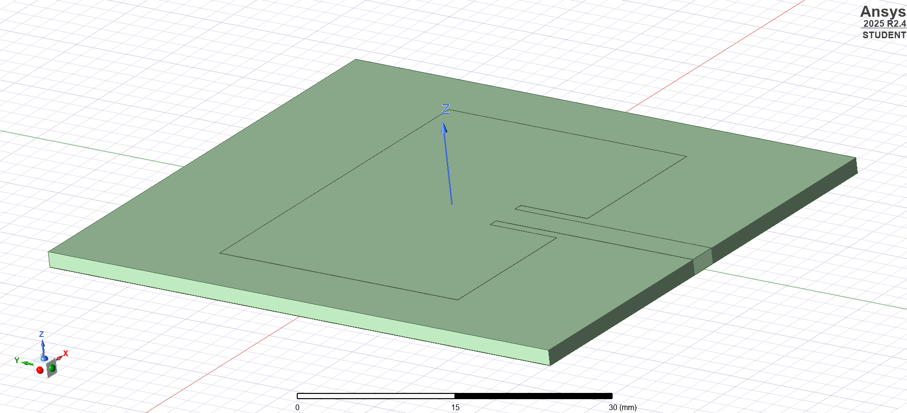

## Design Specifications

| Parameter | Value |
|---|---:|
| Target frequency | 2.45 GHz |
| Substrate | FR4 |
| Relative permittivity | 4.4 |
| Loss tangent | 0.02 |
| Substrate thickness | 1.6 mm |
| Copper thickness | 0.035 mm |
| Patch width | 37.26 mm |
| Initial patch length | 28.83 mm |
| Optimized patch length | 28.54 mm |
| Feed width | 3.0 mm |
| Inset depth | 8.0 mm |
| S-parameter reference impedance | 50 Ω |

The comparison uses the shared nominal antenna dimensions and material values above. Solver settings and results for both models are documented below.

## Design and Optimization

The initial rectangular patch dimensions were calculated analytically and implemented in HFSS. The first full-wave simulation produced a reflection minimum near **2.425 GHz**. To move it toward the 2.45 GHz target, the patch length was reduced from **28.83 mm to 28.54 mm**.

The final HFSS export has its sampled S11 minimum at **2.450 GHz**. With the optimized patch dimensions implemented in CST, the final CST export has its sampled S11 minimum at **2.441 GHz**.

The final models were evaluated using S-parameters, VSWR, input impedance, Smith charts, directivity, realized gain, radiation efficiency, principal-plane radiation patterns, half-power beamwidth, field plots, surface current, and adaptive mesh convergence.

## Simulation Setup

### HFSS

The antenna was modeled in **Ansys Electronics Desktop 2025 R2 / HFSS** using frequency-domain FEM and adaptive tetrahedral meshing. The adaptive solution used **ΔS < 0.02** as its convergence requirement. The exported one-port S-parameters cover **1.5–3.5 GHz** with a **50 Ω** reference impedance; radiation and surface-current results were evaluated at **2.45 GHz**.

### CST

The optimized antenna was reproduced in **CST Studio Suite 2026 Learning Edition**. The substrate measures **50 × 60 × 1.6 mm**, and the conductor material is **Copper (annealed)**. The feed length, including the inset section, is **23.585 mm**. The total inset cut width is **5.0 mm**, leaving **1.0 mm** clearance on each side of the 3.0 mm feed.

The ground occupies **z = −0.035–0 mm**, the substrate **z = 0–1.6 mm**, and the patch and feed **z = 1.6–1.635 mm**.

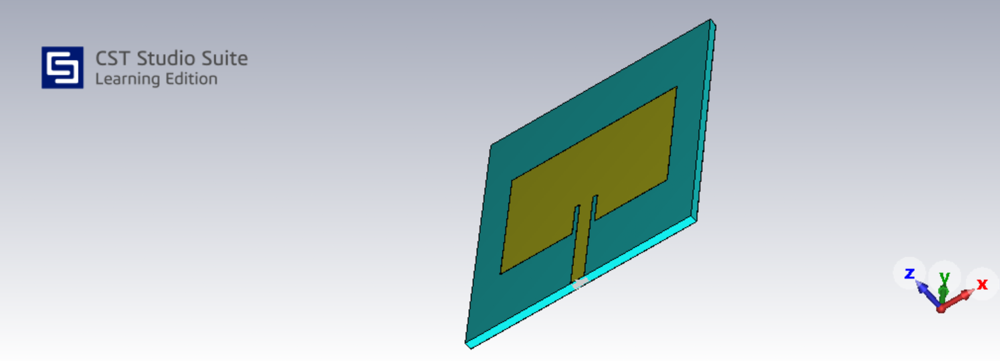

| Setting | CST configuration |
|---|---|
| Solver | Time Domain Solver |
| Mesh | Hexahedral, with adaptive refinement |
| Excitation | One discrete face port between the feed and ground |
| Port/reference impedance | 50 Ω |
| Frequency range | 2.0–3.0 GHz |
| Field and far-field monitors | 2.45 GHz |
| Outer boundaries | Open (add space) |
| Open-boundary reference frequency | 2.0 GHz |
| Symmetry | YZ plane at x = 0; magnetic symmetry, Ht = 0 |
| Steady-state accuracy limit | −50 dB |
| Adaptive mesh convergence criterion | Maximum ΔS < 0.02 |

The final CST solver log reported that the steady-state energy criterion was met and that the desired mesh-adaptation accuracy was reached.

## HFSS–CST Input-Matching Comparison

Both one-port Touchstone exports use **50 Ω**. Target-frequency values are compared at **2.450 GHz**, while each model's sampled minimum is listed separately.

| Quantity | HFSS | CST time domain |
|---|---:|---:|
| S11 at 2.450 GHz | −29.04 dB | −21.89 dB |
| VSWR at 2.450 GHz | 1.073 | 1.175 |
| Input impedance at 2.450 GHz | 50.60 + j3.50 Ω | 58.50 + j1.99 Ω |
| Frequency of sampled S11 minimum | 2.450 GHz | 2.441 GHz |
| Sampled minimum S11 | −29.04 dB | −36.68 dB |
| Estimated −10 dB lower band edge | 2.4111 GHz | 2.4020 GHz |
| Estimated −10 dB upper band edge | 2.4871 GHz | 2.4798 GHz |
| Estimated −10 dB bandwidth | 76.1 MHz | 77.8 MHz |
| Fractional bandwidth, referenced to 2.450 GHz | 3.11% | 3.17% |

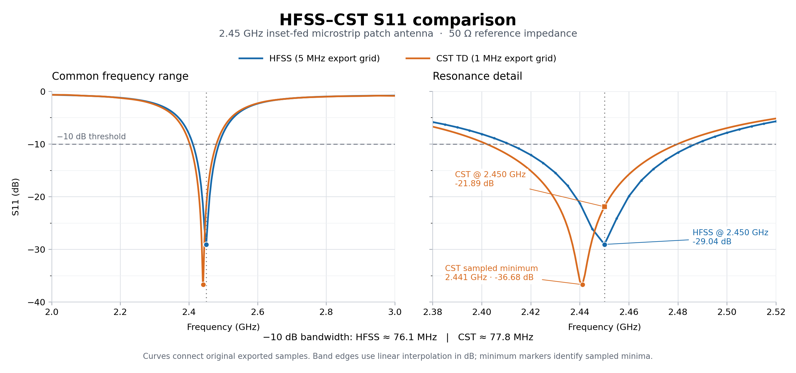

The sampled S11 minima differ by **9 MHz**, approximately **0.37% of the target frequency**, while the estimated bandwidths differ by approximately **1.7 MHz**. Both models show low reflection at 2.45 GHz; the HFSS model has the smaller reflection magnitude at this target frequency.

HFSS data were exported every **5 MHz**, and CST data every **1 MHz**. Minima therefore refer to the exported samples. Band edges were estimated by linear interpolation in dB between neighboring samples, and the plot connects the original samples without smoothing.

Different port representations, open-boundary settings, and mesh discretizations can contribute to the remaining differences. Their individual contributions have not been isolated, and a deeper S11 minimum alone does not establish greater simulation accuracy.

[View the numerical comparison and reproduction method](comparison/hfss_cst_s11_comparison/README.md).

## Individual S11 Results

### HFSS

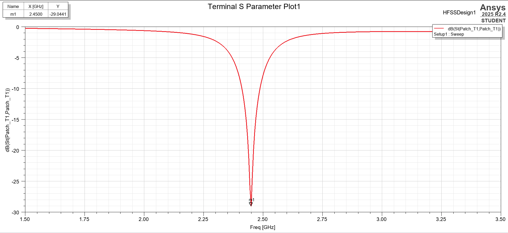

### CST

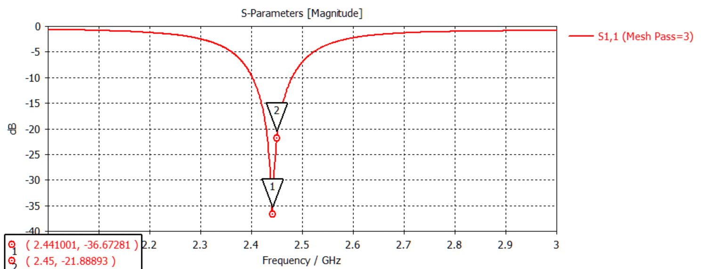

### CST VSWR

The CST VSWR at **2.450 GHz** is **1.175**, consistent with the S11 value in the comparison table.

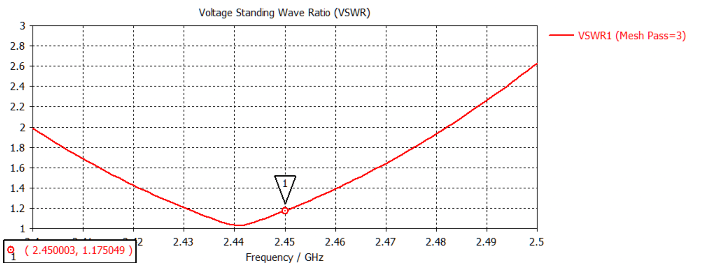

## Input Impedance and Smith Charts

At 2.450 GHz, both input impedances lie near the 50 Ω reference, with small positive imaginary components. The HFSS result is **50.60 + j3.50 Ω**, and the CST result is **58.50 + j1.99 Ω**.

### HFSS

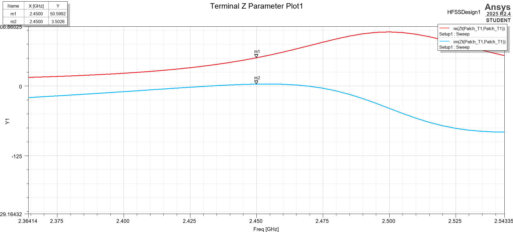

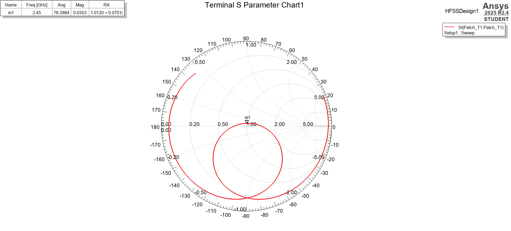

### CST

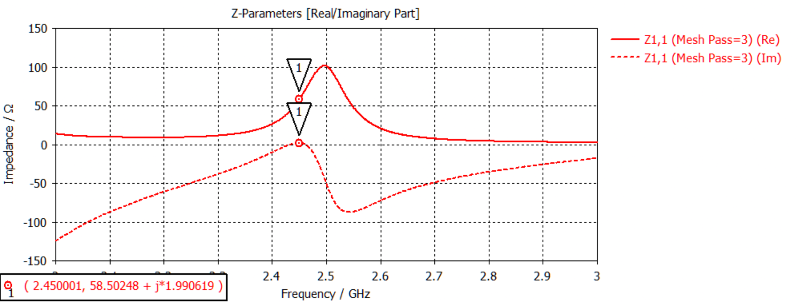

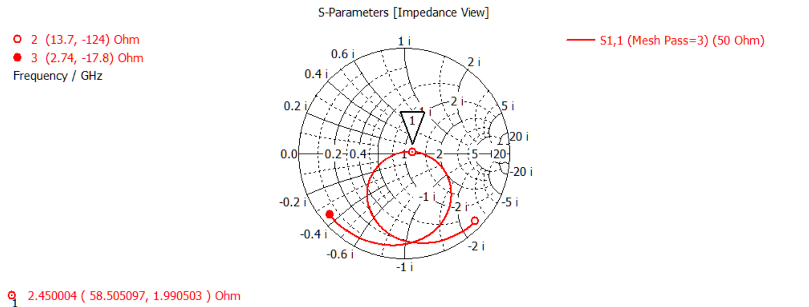

## Radiation Results at 2.45 GHz

| Quantity | HFSS | CST time domain |
|---|---:|---:|
| Peak directivity | ≈6.41 dBi | 6.17 dBi |
| Peak realized gain | 3.53 dBi | 3.25 dBi |
| Radiation efficiency | ≈51.5% | ≈51.4% |
| H-plane HPBW, φ = 0° | ≈99.4° | 100.2° |
| E-plane HPBW, φ = 90° | ≈89.8° | 91.7° |
| Main beam direction | +Z / broadside | +Z / broadside |

Both models produce a broadside main beam approximately along **+Z** and similar radiation efficiencies. The reported peak realized gains differ by approximately **0.28 dB**. The H-plane and E-plane beamwidths differ by approximately **0.8°** and **1.9°**, respectively.

CST also reports a **total efficiency of approximately 51.1%**. Radiation efficiency is referenced to accepted power; total efficiency also includes input mismatch.

### HFSS 3D Realized Gain

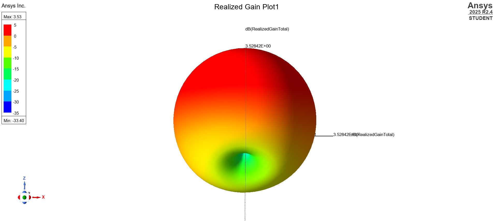

### CST 3D Realized Gain

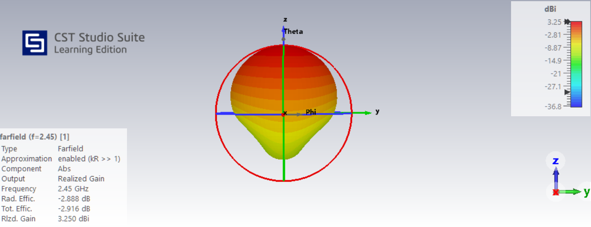

## Half-Power Beamwidth

The half-power beamwidth is measured between the two main-lobe crossings **3 dB below the realized-gain peak** in each cut at 2.45 GHz.

### H Plane — φ = 0°

For HFSS, the reported crossings are approximately **θ = 48.64°** and **θ = 309.24°**. Accounting for the main lobe crossing 0° gives **HPBW ≈ 99.4°**. CST reports **100.2°** for this cut.

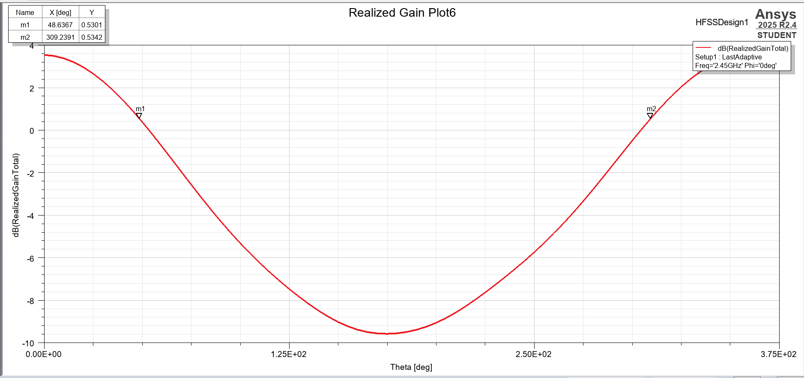

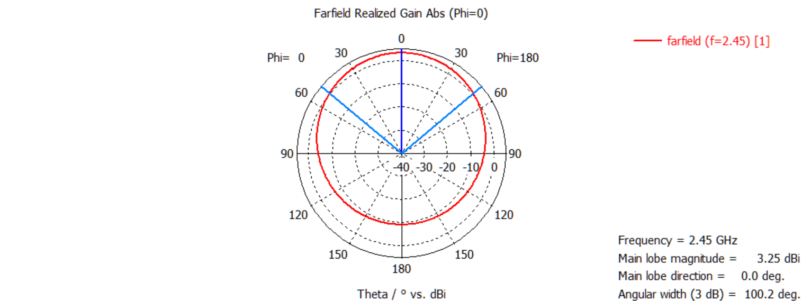

### E Plane — φ = 90°

For HFSS, the reported crossings are approximately **θ = 45.04°** and **θ = 315.24°**, giving **HPBW ≈ 89.8°**. CST reports **91.7°** for this cut.

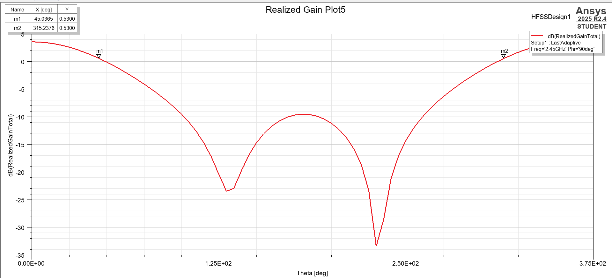

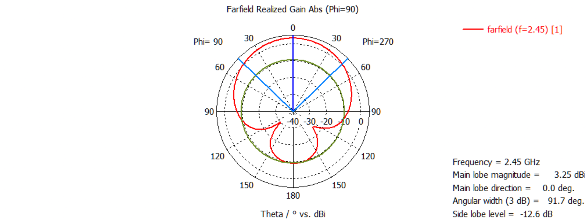

## Surface Current and Fields

Surface-current plots at **2.45 GHz** document current distribution on the conducting patch and inset feed in both models.

### HFSS Surface Current

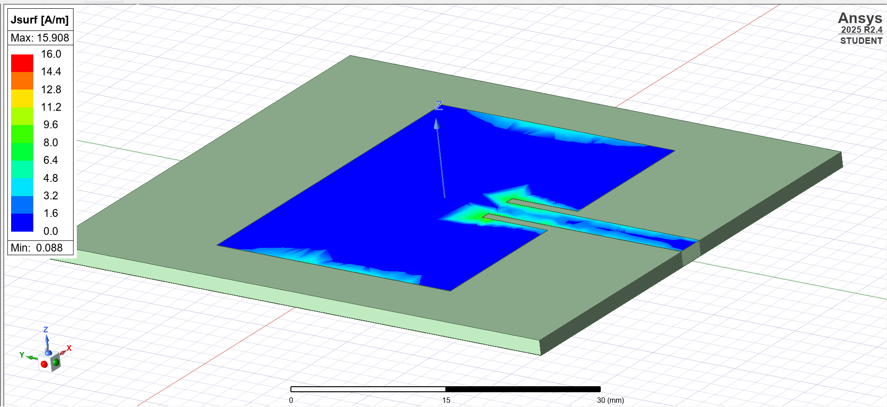

### CST Surface Current

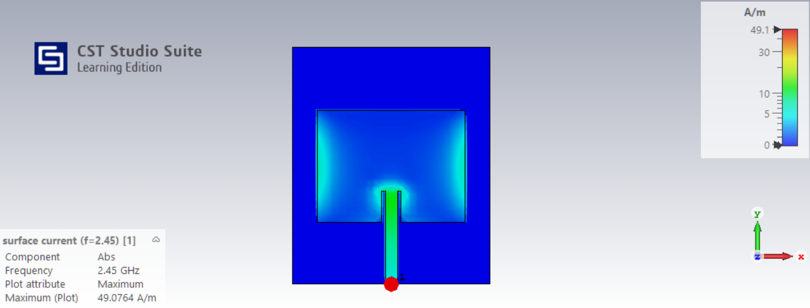

The CST field plots use **Abs** with **Plot Max Field Amplitude** selected. The E-field and H-field are shown on the **z = 0.8 mm plane**, midway through the substrate. The surface-current plot shows the patch and feed from the +Z side.

### CST Electric Field

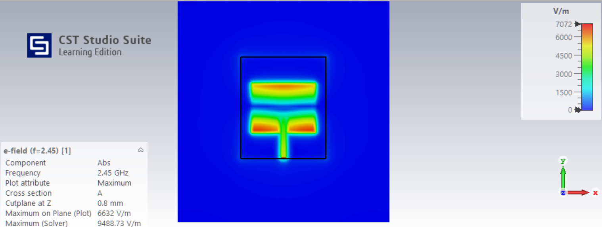

### CST Magnetic Field

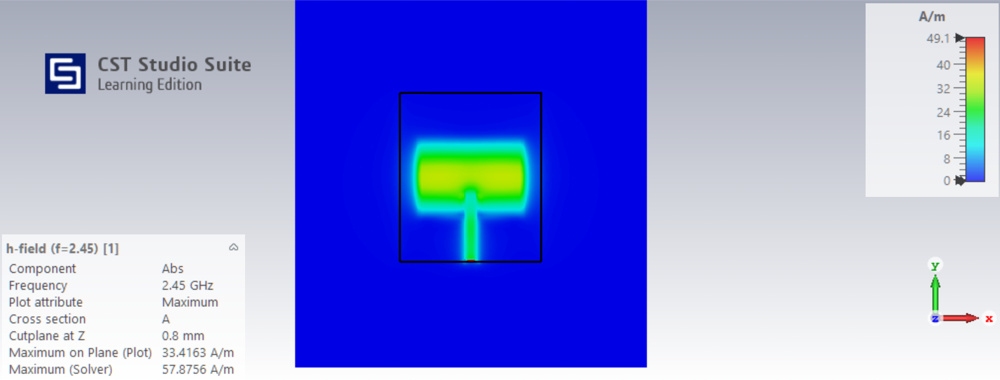

## Adaptive Mesh Convergence

| Check | HFSS | CST time domain |
|---|---|---|
| Configured ΔS criterion | <0.02 | <0.02 |
| Completed adaptive passes | 13 | 3 |
| Reported final convergence | ΔS = 0.011751 | Desired accuracy reached |
| CST mesh-cell history | — | 31,920 → 47,880 |

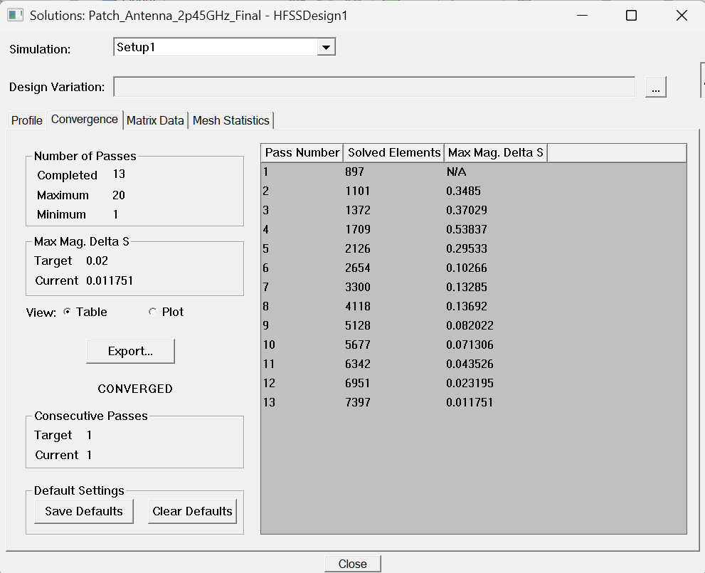

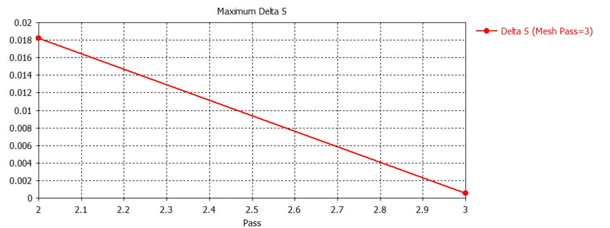

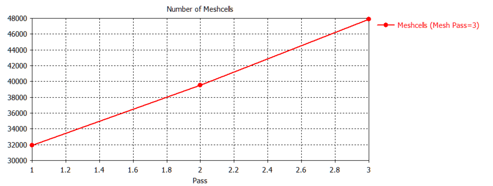

The CST S11 curves from the three adaptive passes document the change during refinement. The Touchstone export used in the numerical comparison is from the final pass.

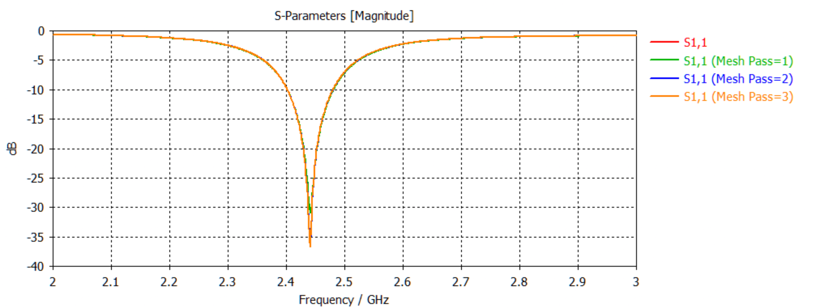

Each model met its configured convergence requirement. Pass counts depend on the solver, starting mesh, and refinement settings, so they are reported as setup evidence rather than as a direct speed comparison.

## Models, Data, and Reproducibility

- [Archived HFSS model](hfss/Patch_Antenna_2p45GHz_Final.aedtz)
- [CST model folder](cst/)
- [Final CST Touchstone export](cst/results/cst_s11_3.s1p)
- [HFSS Touchstone export used in the comparison](comparison/hfss_cst_s11_comparison/data/hfss_s11.s1p)
- [CST Touchstone export used in the comparison](comparison/hfss_cst_s11_comparison/data/cst_s11.s1p)
- [Full numerical comparison table](comparison/hfss_cst_s11_comparison/results/hfss_cst_s11_metrics.csv)
- [Python comparison script](comparison/hfss_cst_s11_comparison/compare_s11.py)

The comparison script regenerates the S11 figure and numerical table directly from the two exports. Instructions are provided in [the comparison README](comparison/hfss_cst_s11_comparison/README.md#reproduce).

## Tools and Methods

- Ansys Electronics Desktop / HFSS: frequency-domain FEM and adaptive tetrahedral meshing
- CST Studio Suite 2026 Learning Edition: Time Domain Solver and adaptive hexahedral meshing
- One-port S-parameter, VSWR, input-impedance, and Smith-chart analysis
- Far-field radiation, realized gain, radiation efficiency, and −3 dB beamwidth evaluation
- Electromagnetic field and surface-current visualization
- Python, NumPy, and Matplotlib for reproducible comparison of Touchstone exports

The project demonstrates agreement between two electromagnetic simulation models. Experimental validation remains a future step requiring a fabricated antenna and measurement data.
